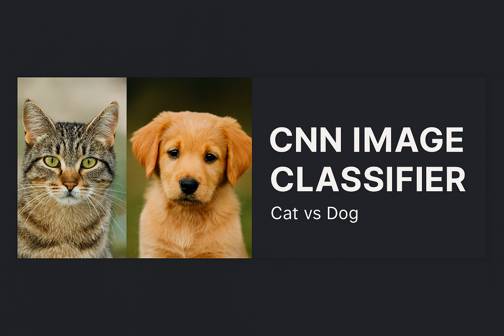
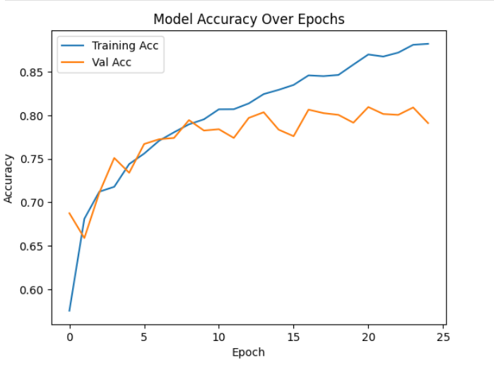
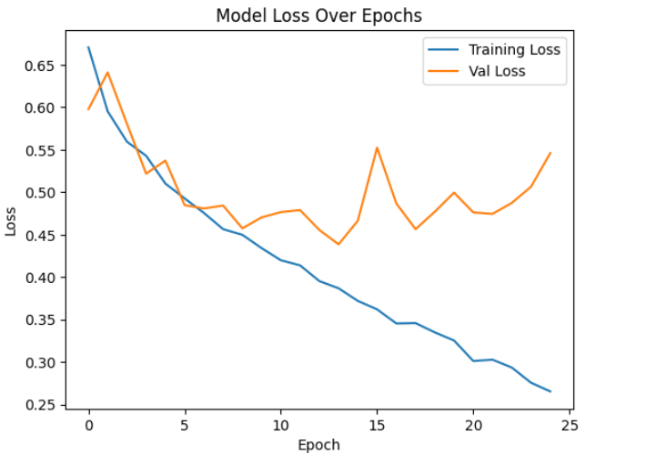

# CNN Image Classifier 🖼️🤖

[](https://www.python.org/)  
[](https://www.tensorflow.org/)  
[](LICENSE)  

> A modular, end-to-end Convolutional Neural Network (CNN) for image classification built with TensorFlow/Keras.  
> Designed for researchers, students, and developers to train, evaluate, and deploy image classifiers efficiently.

---

## 🎯 Project Overview
This repository provides a **complete CNN workflow** for image classification:

- Load and preprocess images.
- Build a customizable CNN architecture.
- Train, validate, and evaluate the model.
- Save and use the model for predictions on new images.
- Visualize performance metrics and training curves.

It’s designed to be **modular, readable, and easy to extend** for custom datasets or advanced architectures.

---

## 📸 Project Thumbnail

  
*Visual representation of the CNN Image Classifier workflow.*

---

## 🏗️ Model Architecture

The CNN model is designed for binary image classification with a simple yet effective architecture. The model is implemented using TensorFlow/Keras.

### Layer-by-Layer Description

1. **Input Layer**  
   - Accepts images with shape `(height, width, channels)` specified by `input_shape`.

2. **Convolutional Block 1**  
   - `Conv2D` with 32 filters, kernel size `3x3`, activation `ReLU`.  
   - `MaxPooling2D` with pool size `2x2` to reduce spatial dimensions.

3. **Convolutional Block 2**  
   - `Conv2D` with 32 filters, kernel size `3x3`, activation `ReLU`.  
   - `MaxPooling2D` with pool size `2x2`.

4. **Flatten Layer**  
   - Converts the 2D feature maps into a 1D vector.

5. **Fully Connected (Dense) Layer**  
   - Dense layer with 128 neurons and `ReLU` activation.

6. **Output Layer**  
   - Dense layer with `num_classes` neurons and `sigmoid` activation (binary classification).  

### Model Compilation
- **Optimizer:** Adam  
- **Loss Function:** Binary Crossentropy  
- **Metrics:** Accuracy  

### Summary Table
| Layer Type           | Output Shape       | Parameters   |
|---------------------|-----------------|-------------|
| Conv2D (32 filters)  | (62, 62, 32)  | 896         |
| MaxPooling2D (2x2)   | (31, 31, 32)  | 0           |
| Conv2D (32 filters)  | (29, 29,32)| 9248       |
| MaxPooling2D (2x2)   | (14, 14, 32)  | 0           |
| Flatten              | 6,272     | 0           |
| Dense (128 neurons)  | 128               | 802,944         |
| Output Dense         | 1               |  129           |

---

## 📊 Accuracy & Loss Over Epochs

Visualizations generated during training provide insights into model performance:

**Training Accuracy vs Epochs**  
  

**Training & Validation Loss vs Epochs**  
  

---

## ⚡ Features
- Modular CNN implementation (`src/model.py`)  
- Data preprocessing & augmentation utilities (`src/data.py`)  
- Notebook demonstrating full workflow (`notebook/cnn_image_classifier_main.ipynb`)  
- Model saving and loading for inference  
- Clear visualizations of metrics and predictions  

---

## 📂 Project Structure

---

## 🛠️ Getting Started

### Prerequisites
- Python ≥ 3.7  
- TensorFlow 2.x  
- Numpy, Matplotlib, Pandas  
- (Optional) GPU for accelerated training  

### Installation
```bash
git clone https://github.com/ArianJr/cnn-image-classifier.git
cd cnn-image-classifier
python -m venv venv
source venv/bin/activate      # Windows: venv\Scripts\activate
pip install -r requirements.txt
```

---

## 🚀 Quick Start

### Training the Model

```python
# Example: run in the notebook or a script
from src.data import load_training_data, load_test_data
from src.model import build_cnn

training = load_training_data('dataset/training_set', (64, 64))
test = load_test_data('dataset/training_set', (64, 64))
model = build_cnn(input_shape=(64,64,3), num_classes=1)
history = model.fit(x=training, validation_data=test, epochs=25)
```

### Using the Notebook

Launch the Jupyter notebook for an interactive demo:
```bash
jupyter notebook notebook/cnn_image_classifier_main.ipynb
```

---

## 📦 Dataset Sample

This repository includes a **sample subset** of the [Dogs vs. Cats dataset](https://www.kaggle.com/datasets/tongpython/cat-and-dog) for demonstration purposes:

- `train/`: 200 images (100 cats, 100 dogs)
- `test/`: 50 images (25 cats, 25 dogs)

This subset is ideal for:
- Testing the modular CNN pipeline
- Validating config-driven training and evaluation
- Keeping the repository lightweight

For full-scale training, download the complete dataset from [Kaggle](https://www.kaggle.com/datasets/tongpython/cat-and-dog).

---

## 🔧 Customization
- Replace or augment dataset (`dataset/` folder).  
- Modify CNN architecture (`src/model.py`).  
- Experiment with hyperparameters (learning rate, batch size, optimizer).  
- Implement transfer learning with pretrained networks.  
- Add evaluation metrics: confusion matrix, precision, recall, F1-score.

---

## ⚙️ Configuration

This project is designed to be easily customizable. You can modify key training parameters directly in the code files:

| Parameter       | Location             | Default Value |
|----------------|----------------------|---------------|
| `input_shape`  | `model.py`           | `(64, 64, 3)` |
| `epochs`       | `cnn_image_classifier.ipynb`        | `25`          |
| `batch_size`   | `cnn_image_classifier.ipynb`        | `32`          |
| `train_dir`    | `data.py`                          | `dataset/training_set` |
| `test_dir`     | `data.py`                          | `dataset/test_set`     |
| `model_path`   | `cnn_image_classifier.ipynb`          | `saved_model/cnn_model.h5` |

These values can be adjusted to suit your dataset size, image resolution, or training goals.

---

## 📈 Results & Performance
| Metric                  | Value        |
|-------------------------|-------------|
| Training Accuracy        | 88.21%      |
| Validation Accuracy      | 79.10%      |
| Final Training Loss      | 0.2653      |
| Final Validation Loss    | 0.5460      |

---

## 🤝 Contributing
1. Fork the repository.  
2. Create a feature branch (`git checkout -b feature/YourFeature`).  
3. Commit changes with clear messages.  
4. Open a pull request.

---

## 📜 License
MIT License – see the [LICENSE](LICENSE) file for details.

---

## 🙏 Acknowledgements
- TensorFlow & Keras communities for excellent tools.  
- Open-source datasets used for training (acknowledge your dataset).  
- Tutorials and guides on CNNs that inspired this workflow.

---

## 👤 Author

**Arian Jr**  
📧 [Contact Me](arianjafar59@gmail.com) • 🌐 [GitHub Profile](https://github.com/ArianJr)

---

<p align="center">
  Made with ❤️ by <a href="https://github.com/ArianJr" target="_blank">ArianJr</a>
</p>

<p align="center">
  <sub>⭐ If you found this project useful, please consider giving it a star! It helps others discover it and supports my work.</sub>
</p>

---

<p align="center">
  
  
</p>
